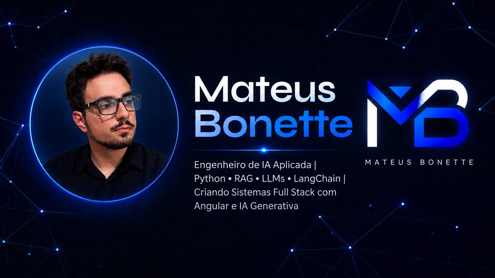

<p align="center">
  
</p>

<h1 align="center">Mateus Bonette</h1>

<h3 align="center">
  Applied AI Engineer | LLMs, RAG, Agents, Python, FastAPI & Full Stack AI Applications
</h3>

<p align="center">
  <strong>RAG • LLMs • LangGraph • LangChain • FastAPI • Python • React • Angular • Node.js • PostgreSQL</strong>
</p>

<p align="center">
  <a href="https://www.mateusbonette.com.br"><strong>Portfolio</strong></a> ·
  <a href="https://www.linkedin.com/in/mateus-bonette/"><strong>LinkedIn</strong></a>
</p>

<p align="center">
  
  
  
</p>

---

## About me

I'm an Applied AI Engineer and Full Stack Developer focused on building practical AI systems with LLMs, RAG, agents, APIs, automation workflows and data-driven applications.

My work combines software engineering, generative AI, backend development, data systems and product thinking to transform manual processes into scalable and useful solutions.

Currently, I work with Python, FastAPI, LangChain, LangGraph, PostgreSQL/pgvector, Docker, Angular, Next.js, APIs and LLM providers such as OpenAI, Claude and Gemini.

I enjoy building systems that connect AI with real business operations: CRM automation, internal tools, dashboards, RAG pipelines, WhatsApp bots, API integrations and decision-support applications.

---

## Positioning

| Area | How I deliver value |
|---|---|
| **Applied AI** | Building solutions with LLMs, RAG, agents, intelligent automation and generative AI workflows. |
| **Full Stack Development** | End-to-end development with frontend, backend, databases, APIs, authentication and deployment. |
| **Automation** | Scripts, API integrations, web scraping, bots and reduction of repetitive operational tasks. |
| **Data** | Analysis, dashboards, visualization, data modeling and exploration with Python. |
| **Product and Business** | Problem understanding, business perspective, user experience and result-oriented delivery. |

---

## Main Stack

### AI, LLMs, RAG and Automation


### Frontend and Mobile


### Backend, APIs and Databases


### Data, ML and Visualization


### Dev Tools, AI Development and Cloud


### Product, Design and Process


---

## Featured Projects

| Project | Description | Stack / Area | Link |
|---|---|---|---|
| **OpenClaw / AI Agents Platform** | Platform with AI agents, automation workflows, LLMs, RAG and intelligent flows applied to digital operations. | Applied AI, RAG, LLMs, Agents, Automation | In progress |
| **FBA Automation** | Full stack automation system designed to reduce manual work in supplier analysis, product research and business routines. | React, FastAPI, Python, Playwright, PostgreSQL, Docker | [View repository](https://github.com/mateus-bonette00/fba-automation) |
| **CoinSight TCC** | Undergraduate thesis project focused on cryptocurrency price analysis and prediction using data, news and external factors. | Python, Streamlit, PostgreSQL, ML, Data Analysis | [View repository](https://github.com/mateus-bonette00/coinsight_tcc) |
| **Qota Finance** | Financial dashboard for tracking and analyzing transactions, orders and operational integrations. | React, Node.js, TypeScript, APIs, Dashboards | Private repository |
| **Mateus Bonette Portfolio** | Personal website with projects, experience, technologies and professional positioning. | Portfolio, Product, Frontend | [View portfolio](https://www.mateusbonette.com.br) |
| **FamilyMoney** | Full stack financial system for organizing income, expenses, accounts and financial overview. | Angular, Node.js, PostgreSQL, Pluggy | Project in progress |
| **Medical Clinic Web Project** | Web system for a medical clinic, focused on organization, interface and service flow. | Web, Frontend, UX | [View repository](https://github.com/mateus-bonette00/ProjetoWeb_ClinicaMedica) |
| **COVID-19 Brazil Overview** | Data analysis and visualization project about COVID-19 in Brazil. | Python, Pandas, Matplotlib | [View repository](https://github.com/mateus-bonette00/Panorama-do-COVID-19-no-Brasil) |

---

## How I think and build solutions

```text
Real problem → User context → Business rules → Simple architecture → Automation/AI when it adds value → Clear delivery
```

<details>
  <summary><strong>See how I work</strong></summary>

- I understand the problem before choosing the technology.
- I look for simple, useful and evolvable solutions.
- I use AI when it reduces work, improves decisions or creates a better experience.
- I like documenting decisions, workflows and next steps.
- I think about maintenance, clarity, cost, risk and production impact.

</details>

<details>
  <summary><strong>Areas I'm most interested in today</strong></summary>

- Applied AI Engineering
- Production-ready RAG
- Agents with LangGraph and LangChain
- LLMs integrated into real systems
- AI-powered process automation
- Full Stack AI Applications
- Intelligent dashboards
- APIs, data and integrations

</details>

---

## GitHub Metrics

<p align="center">
  
  
</p>

---

## In short

I'm a developer with a strong product, business and engineering mindset, focused on building solutions that connect **software, applied AI, automation and data** to solve real-world problems.

<p align="center">
  <a href="https://www.mateusbonette.com.br">
    
  </a>
  <a href="https://www.linkedin.com/in/mateus-bonette/">
    
  </a>
</p>
