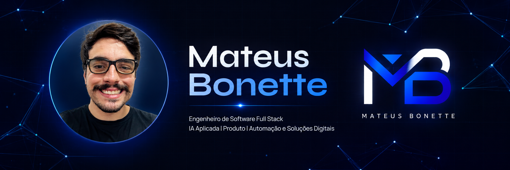

  

<h1 align="center">Mateus Bonette</h1>

  <strong>Engenheiro de Software Full Stack | IA Aplicada | Produto | Automação e Soluções Digitais</strong>

  <a href="https://www.mateusbonette.com.br"><strong>Portfólio</strong></a> ·
  <a href="https://www.linkedin.com/in/mateus-bonette/"><strong>LinkedIn</strong></a>

---

## Sobre mim

Sou formado em Ciência da Computação pela Universidade Federal de Itajubá, UNIFEI, e trabalho com desenvolvimento full stack, IA aplicada, automação, produto e soluções digitais.

Antes de programar profissionalmente, atuei com vendas, marketing, área comercial e contato direto com clientes. Essa vivência me ajuda a entender problemas reais, comunicar valor com clareza e construir soluções úteis para o usuário e para o negócio.

Hoje, uno domínio técnico, visão de produto e mentalidade de dono para resolver problemas difíceis, automatizar rotinas e transformar tarefas manuais em processos inteligentes.

Meu foco é entregar soluções simples, úteis, bem estruturadas e com impacto real.

---

## Como eu trabalho

| Área | Como aplico na prática |
|---|---|
| **Resolução de problemas** | Entendo o problema antes de propor solução. Busco clareza, contexto e impacto real. |
| **Comunicação de valor** | Traduzo tecnologia para quem decide, conectando solução, usuário e negócio. |
| **Automação** | Identifico tarefas repetitivas e transformo em fluxos automatizados com APIs, scripts e IA. |
| **Produto** | Penso como dono: oportunidade, custo, execução, retorno e experiência final. |
| **Full stack** | Trabalho do front ao banco, conectando interface, regras de negócio, dados e deploy. |
| **IA aplicada** | Uso agentes, LLMs, automações inteligentes e visão computacional para resolver problemas práticos. |

---

## Tecnologias que uso para entregar

### Frontend e Mobile

### Backend, APIs e Bancos

### Dados e Visualização

### IA, Automação e Dev Tools

### Design, Produto e Processo

---

## Projetos em destaque

| Projeto | Descrição | Link |
|---|---|---|
| **Portfólio Mateus Bonette** | Meu site pessoal com projetos, experiências, tecnologias e posicionamento profissional. | [Ver portfólio](https://www.mateusbonette.com.br) |
| **Qota Finance** | Sistema de controle financeiro com front-end web, backend Node.js, Express e SQLite. | Repositório privado |
| **FBA Automation** | Automação para reduzir trabalho manual em análise de fornecedores, produtos e rotinas de negócio. | [Ver repositório](https://github.com/mateus-bonette00/fba-automation) |
| **CoinSight TCC** | Projeto de TCC sobre predição de preços de criptomoedas com dados, redes sociais e fatores geopolíticos. | [Ver repositório](https://github.com/mateus-bonette00/coinsight_tcc) |
| **Projeto Web Clínica Médica** | Sistema web para clínica médica, com foco em organização, interface e fluxo de atendimento. | [Ver repositório](https://github.com/mateus-bonette00/ProjetoWeb_ClinicaMedica) |
| **Panorama do COVID-19 no Brasil** | Projeto de análise e visualização de dados sobre a COVID-19 no Brasil. | [Ver repositório](https://github.com/mateus-bonette00/Panorama-do-COVID-19-no-Brasil) |
| **ItaCar, POO2 com Django** | Projeto acadêmico com Django, organização backend e aplicação web. | [Ver repositório](https://github.com/mateus-bonette00/projetoPOO2_Django) |
| **Aplicativo TecHouse** | Aplicativo mobile desenvolvido com foco em interface, fluxo e experiência do usuário. | [Ver repositório](https://github.com/mateus-bonette00/aplicativo_techouse) |

---

## Em resumo

Gosto de pegar um problema real, entender o lado humano e comercial, criar uma solução simples e usar tecnologia, IA e automação para eliminar o que toma tempo das pessoas.

  
  

